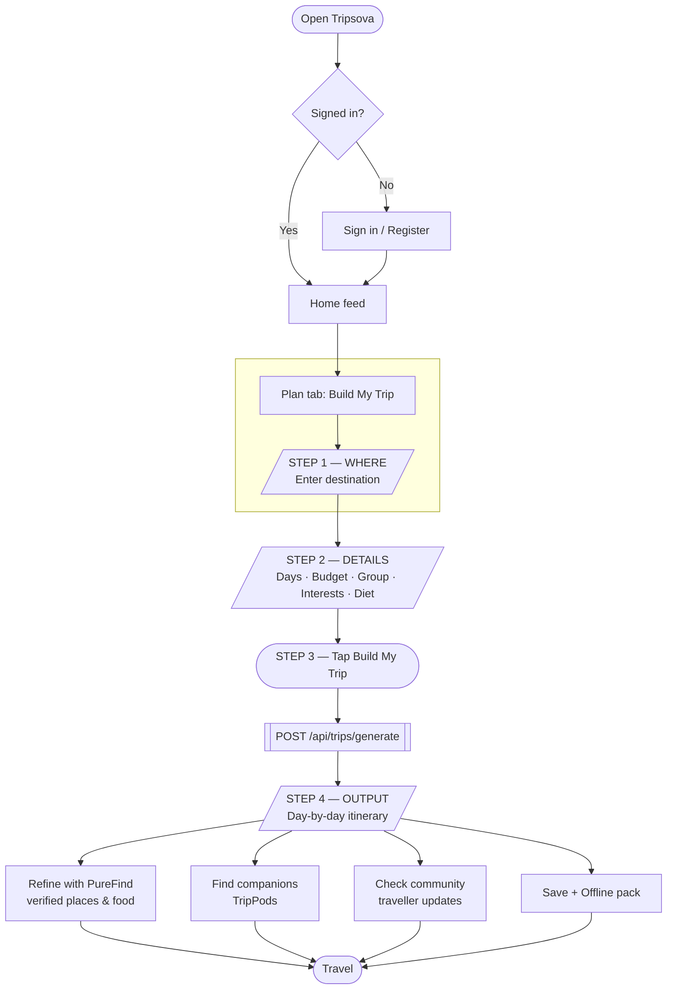

# Tripsova — User Workflow

> **In one line:** the traveller starts with **Where**, tells Tripsova about the trip,
> and gets back a **verified, diet-aware, day-by-day plan** — plus companions,
> community updates and an offline pack. Everything is *Powered by Travellers*.

This document describes the end-to-end journey a real user takes through the app:
**start → choose Where → build → output → act on it.** It is grounded in the
actual screens and API contracts (not aspirational).

---

## 1. The journey at a glance



---

## 2. Step-by-step (the happy path)

### Stage 0 — Get in (onboarding)
- The user lands on the **Sign-in screen**.
  - **Desktop (≥1024px):** two-column split — a navy brand panel (logo, value
    props: PureFind, TrustScore, TripPods, Offline packs) on the left, the form
    on the right.
  - **Mobile (<1024px):** a single centered form.
- New users tap **Register**; returning users sign in.
- **Demo accounts:** `traveller@tripova.com` / `admin@tripova.com` — password `password123`.

### Stage 1 — WHERE *(the starting point)*
The trip begins on the **Plan** screen (header: **✦ Build My Trip**). The very
first field is the **destination**:

| Field | Example | Notes |
|-------|---------|-------|
| **Destination** *(required)* | `Manali`, `Goa`, `Spiti`, `Udaipur` | This is the **Where**. Nothing else runs until it's filled. |

> If the user taps *Build* without a destination, the app shows **"Please enter a destination"** and stops. **Where is mandatory.**

### Stage 2 — DETAILS (tell us about the trip)
Once **Where** is set, the user fills the rest of the form:

| Field | Options / Type | Maps to API field |
|-------|----------------|-------------------|
| **Days** | number (e.g. 4) | `days` |
| **Budget (₹)** | number (e.g. 10000) | `budget` |
| **Group Type** | Solo · Couple · Family · Friends | `tripType` (+ derives `peopleCount`: Solo→1, Couple→2, else→4) |
| **Interests** | Adventure, Nature, Food, Culture, Spiritual, Photography, Shopping, Wellness | `travelStyle[]` |
| **Diet** | Jain, Pure-veg, Vegan, Halal, Gluten-free, Sattvic… (multi-select) | `dietPreference[]` |

### Stage 3 — BUILD (the action)
The user taps **✦ Build My Trip**. The app calls:

```http
POST /api/trips/generate          (Authorization: Bearer <token> required)
Content-Type: application/json
```
```jsonc
{
  "destination": "Udaipur",
  "days": 4,
  "budget": 10000,
  "peopleCount": 2,
  "tripType": "Couple",
  "travelStyle": ["Culture", "Food"],     // optional
  "dietPreference": ["pure_veg"],          // optional
  "startDate": null,                        // optional
  "offlineRequired": null                   // optional
}
```
The button shows **"Crafting your journey…"** while it works. If the API is
unreachable, the screen falls back to a locally-generated sample itinerary so the
user is never blocked.

### Stage 4 — OUTPUT (what the user gets back)
The response renders as a structured itinerary:

```jsonc
{
  "summary": "…",
  "itinerary": [ { "day": 1, "title": "Arrival & First Light",
                   "morning": {...}, "afternoon": {...}, "evening": {...} } ],
  "recommendedPlaces": [ … ],   // verified attractions
  "recommendedFood":   [ … ],   // diet-aware restaurants/cafés
  "estimatedBudget":   { "total": … },
  "safetyNotes":       [ … ],
  "offlinePackSuggested": true
}
```

On screen the traveller sees:
1. **Trip header** — 📍 destination, **estimated total cost**, diet badges.
2. **Day-by-day plan** — for each day: **Morning / Afternoon / Evening**, each with
   an **activity**, a short **description**, a **cost** (💰) and a **food** suggestion (🍽).
3. **💡 Pro Tips** — safety notes + practical advice (booking lead time, diet
   confirmation calls, solo-safety, expense-splitting, etc.).

> **The output is the answer to "what happens": a complete, costed, diet-aware,
> day-by-day itinerary the traveller can act on immediately.**

---

## 3. After the plan — acting on it

| Want to… | Go to | What it does |
|----------|-------|--------------|
| Find **verified places & food** | **PureFind** / Discover | Diet-aware, **trust-ranked** results (not ads). Public pages: `/destinations/[slug]`, `/food/[slug]`. |
| Find **travel companions** | **TripPods** | Match with verified travellers heading the same way. |
| See **live ground truth** | **Home feed** | Four live sections — **CityFeed** (real traveller updates: safety, crowd, weather, price, food; mark **Helpful** or **Report**) → **Trip Pulse** (trending destinations) → **TripPod** (companions heading your way) → **PureFind** (diet-aware food). |
| **Save / travel offline** | Offline pack | Download the trip so it works with no signal. |
| **Contribute** | **Create** | Post an update, verify a place's diet status, build trust. |

---

## 4. Why the output is trustworthy (how ranking works)

Tripsova never ranks by ads. Every place/food result carries a **Tripova score**
combined from multiple signals (see `places/ranking.py`):

- external rating + **review confidence**
- **popularity**
- **TrustScore** (credibility of the travellers behind the data)
- **traveller verification** (e.g. diet status confirmed by N travellers)
- **freshness** (recent updates weigh more)
- **food score** + **safety score**
- **penalties** for thin / stale / low-trust entries

Community deep-reviews (e.g. Reddit) are used **only as corroboration**, never as a
primary source.

---

## 5. Screen & route reference

| Surface | Route | Rendering |
|---------|-------|-----------|
| App (feed, plan, discover, pods, profile) | `/` | Client app shell (responsive: sidebar ≥1024px, bottom-nav on mobile) |
| Destinations index | `/destinations` | SSR (SEO) |
| Destination guide | `/destinations/[slug]` | SSR + `TouristDestination` JSON-LD |
| Food / restaurant | `/food/[slug]` | SSR + `Restaurant` JSON-LD |
| Sitemap / robots | `/sitemap.xml`, `/robots.txt` | Generated |

## 6. API quick reference

| Method | Endpoint | Auth | Purpose |
|--------|----------|------|---------|
| `POST` | `/api/trips/generate` | ✅ | Build an itinerary from the form (Stages 3–4) |
| `GET`  | `/api/trips/my` | ✅ | List the user's saved trips |
| `GET`  | `/api/trips/{trip_id}` | – | Fetch one trip |
| `GET`  | `/api/destinations`, `/api/destinations/{slug}` | – | Browse destinations |
| `GET`  | `/api/places`, `/api/places/{id-or-slug}` | – | Places & food (PureFind) |
| `GET`  | `/api/feed` · `POST /api/feed` | – / ✅ | Community updates |

---

*Powered by Travellers.*
